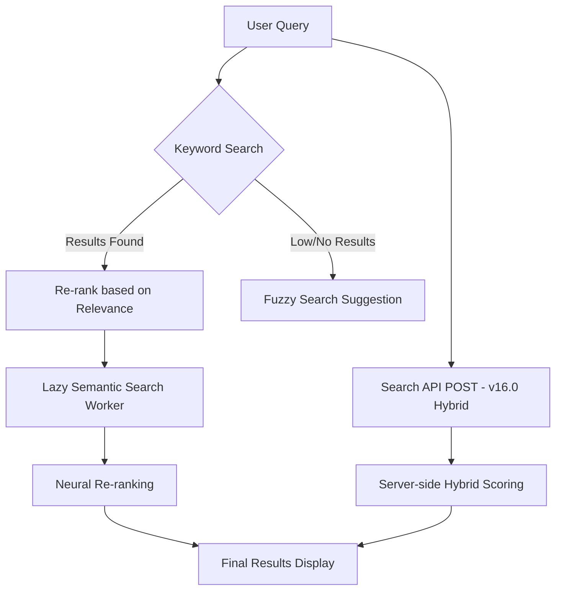
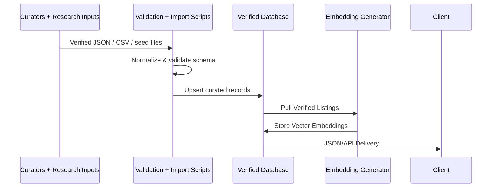

# CareConnect - Architecture Overview

## Tech Stack

- **Framework**: [Next.js 15](https://nextjs.org/) (App Router)
- **Language**: TypeScript
- **Styling**: Tailwind CSS v4 + Radix UI
- **Database**: Supabase (PostgreSQL + Vector)
- **Internationalization**: `next-intl` (Support for EN, FR, AR, ZH-Hans, ES, PT, PA)
- **Testing**: Playwright (E2E), Vitest (Unit)

## Directory Structure

- `app/`: Next.js App Router pages and API routes.
  - `[locale]/`: Localized routes.
  - `api/v1/`: RESTful API endpoints. (See [OpenAPI Spec](api/openapi.yaml))
  - `[locale]/offline/`: PWA offline page (Workbox navigation fallback targets `/offline`).
  - `worker.ts`: Semantic search Web Worker.
- `components/`: UI components.
  - `ui/`: Standardized primitives (Button, etc.).
- `hooks/`: Custom React hooks (`useSearch`, `useServices`).
- `lib/`: Utility functions (API helpers, search logic).
- `types/`: TypeScript definitions.
- `messages/`: Localization dictionaries (EN, FR, AR, ZH-Hans, ES, PT, PA).
- `docs/`: Project documentation.

## Core Concepts

### Search Architecture

The search system uses a hybrid approach:

1. **Instant Keyword Search**: Filters results locally/via basic db queries for immediate feedback.
2. **Fuzzy Search ("Did you mean?")**: If results are low, the Levenshtein algorithm suggests alternative queries based on service names and tags.
3. **Lazy Semantic Search**: Loads the optional browser embedding worker in the background and upgrades local search with vector similarity only after the model initializes successfully. If worker initialization or embedding generation fails, the app fails closed to keyword-only search instead of emitting synthetic vectors.
4. **Search API (v16.0 Enhancements)**: A server-side alternative (`POST /api/v1/search/services`) that implements complex ranking factors including authority tiers, data completeness boosts, intent targeting, and continuous proximity decay. It uses a hybrid strategy: fetching candidates from the DB and scoring them in-memory using TypeScript logic to ensure consistency with client-side rankings. The shared request contract now carries `category`, `location`, and `openNow` filters in both modes, including empty-query "open now" browsing.
5. **Governance Freshness Enforcement**: Both local and server search exclude records that fall outside the 180-day public-visibility window so stale listings do not keep ranking with only a soft penalty.
6. **Result Explainability**: Public result cards and linked detail pages can surface normalized match reasons so users can inspect why a service ranked for their query.

### Search Modes

The application supports two search modes, controlled by `NEXT_PUBLIC_SEARCH_MODE`:

1. **Local (Default)**: Downloads a compressed JSON bundle of all services. Search logic runs entirely in the browser. Best for offline support and zero-latency typing.
2. **Server**: Sends `POST` requests to the Librarian API. The server executes the query and returns results. Best for large datasets (>1000 items) and devices with limited RAM. (Note: Server mode does not load the JSON bundle, saving bandwidth).

### AI Assistant Architecture

- **Engine**: `@mlc-ai/web-llm` (WebGPU) running in a Web Worker for UI responsiveness.
- **Strategy**: "LLM-as-Search" (query rewrite/expansion) + deterministic rendering of search results.
- **Privacy**:
  - **Local-Only**: Inference runs entirely in the user's browser.
  - **No Data Egress**: Queries never leave the device.
  - **Zero-Knowledge**: Server knows _that_ a user is chatting, but not _what_ they are saying.
  - **Zero-Logging Search (v13.0)**: When using Server Search, queries are sent as `POST` (no URL logs) with `Cache-Control: no-store`. The database `services_public` view enforces a strict data boundary.
  - **Share Target Handoff**: `POST /api/v1/share` stores shared search text in a short-lived first-party cookie and redirects without `?q=` so sensitive share text does not land in URLs, history, or referrers.
- **Lifecycle**:
  - **Opt-In**: Model download only triggered by explicit user action.
  - **Idle Cleanup**: VRAM released after 5 minutes of inactivity.

### Privacy-Preserving Personalization

- **Client-Side Profile**: User demographics (Age, Identities) stored in `localStorage` (`careconnect_user_context`).
- **Zero PII**: No user accounts, login, or cookies required for basic personalization.
- **Local Eligibility**: "Likely Qualify" checks run locally by parsing cached service data against the local profile.
- **Identity Boosting**: Search ranking adjustments happen on the client-side `WebWorker`.

### Data Pipelines

- **Source of Truth**: Manually curated service records remain authoritative. In development they live in `data/services.json`; in production the app reads from Supabase when configured, with local JSON fallback when the database is unavailable.

- **Ingestion**:
  - Human-reviewed JSON, CSV, and municipal/provider seed files are validated before import.
  - `scripts/import/geojson-import.ts`: Generic utility for ingesting municipal (City of Kingston) and specialized (Indigenous/Faith) seed files.
  - `generate-embeddings.ts`: Generates logical-semantic embeddings at build time.
- **Versioning**: `generate-changelog.ts` tracks diffs between syncs.
- **Offline Export Contract**: `/api/v1/services/export` sanitizes the public payload, derives a stable SHA-256 fingerprint for both `version` and `ETag`, and offline sync clears the in-memory service cache after a successful refresh so newly synced data is visible immediately.

### User Feedback & Impact Loop (v14.0)

- **Architecture**: Privacy-preserving feedback system.
- **Pipeline**: Client (`FeedbackWidget`) -> API (`/api/v1/feedback`) -> Supabase (`feedback` table).
- **Aggregations**: Database materialized views (`feedback_aggregations`, `unmet_needs_summary`) provide performant metrics for the `/impact` page and Partner Dashboard.
- **Privacy**: No PII, cookies, or persistent IDs are stored. Rate limiting is handled in-memory.

### Equity-First Access (v14.0)

- **Localization Parity**: Full UI translation coverage for all 7 supported locales. Mandatory EN/FR parity for all service data.
- **Simplified Views**: Optional plain-language summaries (Grade 6-8 reading level) for high-impact services, stored in `plain_language_summaries`.
- **Low-Bandwidth Outputs**: Printable "Resource Cards" optimized for physical distribution and accessibility.
- **Printable Card Privacy**: Printable cards escape interpolated service content and render QR codes locally as inline data URLs instead of calling third-party QR hosts.

### Visible Verification & Trust Signals (v14.0)

- **Provenance**: `TrustPanel` displays `last_verified` dates, verification methods, and source provenance to build user confidence.
- **Verification Levels**:
  - `L1`: Basic verification.
  - `L2`: Manual verification by CareConnect team.
  - `L3`: Partner-claimed and verified.
  - `L4`: Governance-level policy concept for future partner/audit workflows; not currently represented in runtime types or search scoring.
- **Partner Update Workflow**: Structured request-approval loop via `service_update_requests` ensures data integrity while engaging service providers.

### Push Notifications

- **Technology**: Web Push API + Service Worker (`public/sw.js`, plus `public/custom-sw.js` for app-specific hooks).
- **Flow**: User Opt-In -> Service Worker Subscribes -> Endpoint stored in `push_subscriptions` -> Server-side trigger via VAPID keys.
- **Privacy**: No PII linked to subscriptions. User can revoked at any time via browser settings.

### Automated Maintenance Bots

- **URL Health Bot**: Monthly check of all service URLs (`scripts/health-check-urls.ts`).
- **Phone Validator**: Connectivity checks using Twilio Lookup API (`scripts/validate-phones.ts`).
- **Automation**: GitHub Actions (`.github/workflows/health-check.yml`) create issues for human review upon detection of failures.

### Database Security & Row Level Security (RLS)

- **Security Model**: Supabase PostgreSQL with Row Level Security ensures data isolation and privacy.
- **Public Views**: `services_public` view created with `security_invoker = true` to use invoker's permissions (not definer's).
- **Hardened Policies**: All INSERT policies validate foreign keys (e.g., `service_id IN (SELECT id FROM services_public)`) to prevent spam and invalid data.
- **Performance Optimizations**: Auth function calls wrapped in scalar subqueries `(SELECT auth.uid())` to avoid per-row re-evaluation.
- **Policy Consolidation**: Separate policies for SELECT/INSERT/UPDATE/DELETE to avoid "Multiple Permissive Policies" performance warnings.
- **Public Transparency**: Aggregated metrics are exposed via **Standard Views** (`feedback_aggregations`, `unmet_needs_summary`) that wrap underlying Materialized Views (`mat_*`). These wrappers enforce `security_invoker = true` to ensure the query runs with the user's permissions, satisfying security audits while maintaining API compatibility.
- **Documentation**: See [Database Security Guide](security/database-security.md) for complete RLS policy documentation.
- **Testing**: RLS policies verified via `tests/integration/rls-policies.test.ts`.

### Partner Dashboard & RBAC

- **Access Control**: Role-Based Access Control (RBAC) implemented via `organization_members` table.
- **Roles**: `owner`, `admin`, `editor`, `viewer`.
- **Functions**: CRUD operations for listings, member invites (invite/accept flow), and analytics viewing.
- **Multi-Lingual Content**: Self-service editing for English and French fields (local services are EN/FR only).
- **Mutation Guardrails**: Partner-facing write APIs use an explicit allowlist for editable fields. `owner` and `admin` can mutate any service in their organization, `editor` is limited to compatible ownership signals on services they created, and `viewer` is denied. Direct `access_script` edits remain on the update-request path until persistence is formalized.

### Data Flow

- **Services**: Fetched via `/api/v1/services`. Cached using SWR-like strategies in hooks.
- **Analytics**: Aggregate-only search events (`locale` + `resultCount`) are posted to `/api/v1/analytics/search` asynchronously. Raw query text, category, and location are not stored.

### v22 Phase 0 Pilot Instrumentation (Internal)

- **Purpose**: Capture pilot-only connection outcome signals before Phase 1 feature rollout.
- **Internal Endpoints**:
  - `POST /api/v1/pilot/events/contact-attempt`
  - `POST /api/v1/pilot/events/connection`
  - `POST /api/v1/pilot/events/referral`
  - `POST /api/v1/pilot/events/service-status`
  - `POST /api/v1/pilot/events/data-decay-audit`
  - `POST /api/v1/pilot/events/preference-fit`
  - `PATCH /api/v1/pilot/events/referral/{id}`
  - `POST /api/v1/pilot/scope/services`
  - `POST /api/v1/pilot/metrics/recompute`
  - `POST /api/v1/pilot/integration-feasibility`
  - `GET /api/v1/pilot/metrics/scorecard`
- **Security Model**:
  - Authenticated session required for all pilot endpoints.
  - Organization-scoped authorization enforced for event writes and scorecard reads.
  - Admin authorization required for integration feasibility decision writes.
- **Privacy Constraints**:
  - Request payload validation rejects disallowed keys (`query`, `query_text`, `message`, `user_text`, `notes`).
  - Raw query text is never accepted into pilot event contracts.
  - Repeat-failure attribution uses opaque `entity_key_hash` values rather than raw identifiers.
- **Resilience**:
  - Pilot DB operations use circuit-breaker-wrapped storage access.
  - If pilot tables are not present, endpoints fail with explicit `501` responses to prevent silent data loss.
  - Metric recompute writes canonical snapshots to `pilot_metric_snapshots`; scorecard reads stay snapshot-based.
- **Readiness Reporting**:
  - `pilot_service_scope` is the canonical scoped-service source for bounded pilot readiness audits.
  - `npm run audit:pilot-readiness -- --pilot-cycle-id <id> [--org-id <uuid>]` exports scoped JSON, Markdown, and CSV artifacts without mutating curated service data.
  - `docs/implementation/v22-pilot-readiness/` contains the scope-file-first handoff bundle, including the runbook and `scope.template.json` for cases where a committed pilot cycle does not yet exist.

### Routing & Discovery

- **Public Routes**:
  - `/service/[id]`: Rich detail page.
  - `/submit-service`: Public crowdsourcing form.
  - `/dashboard`: Partner portal.
  - `/about`: Project mission and impact metrics. Includes **Katarokwi Land Acknowledgment**.
  - `/about/partners`: Data source transparency and verification process.
- **Provincial Services Discovery**:
  - `is_provincial` flag allows services to be promoted in search results globally.
  - Provincial services display a "Province-Wide" badge for clarity.
- **Language Selection**:
  - `LanguageSelector` component in `Header` provides 7-locale switching.
  - Arabic triggers RTL (Right-to-Left) direction in root layout.
- **Internal Links**: `ServiceCard` now links to internal detail pages instead of external URLs.

### Partner Claim Workflow

- **Claim Logic**: Unclaimed services can be claimed by authenticated organizations.
- **Verification**: Claiming a service automatically elevates its status to `L1`.
- **Atomic Operations**: `lib/services.ts` handles the claim logic with database consistency checks.

### Hooks Architecture

We use a modular hook system to separate concerns:

- **Search Hooks**: `useSearch` coordindates state, `useServices` handles logic, and `useSemanticSearch` manages the worker.
- **Utility Hooks**: Generic hooks for `localStorage` and `Geolocation` ensure SSR safety and consistency.

### Logging & Monitoring

- **Logger Utility**: Located in `lib/logger.ts`. Use instead of `console.log`.
- **Error IDs**: The Error Boundary generates unique IDs (e.g., `ERR-K9X2J1`) for cross-referencing logs with user reports.
- **Health Visibility**: In production, `/api/v1/health` exposes only basic public status. Detailed health checks remain admin-only.

### User Interface & Accessibility

- **High Contrast Mode**: Global state managed via `useHighContrast` hook, applying `.high-contrast` class and CSS variable overrides.
- **Print Optimization**: Specific `@media print` styles in `globals.css` and `PrintButton` component for physical delivery of information.
- **Data Freshness**: `FreshnessBadge` provides visual cues on the reliability of data based on `last_verified` / `provenance.verified_at`, including an explicit expired state once a record crosses the 180-day governance limit.
- **Offline Safety Surfaces**: `OfflineSnapshotStatus` reads IndexedDB sync metadata (`lastSync`) and shows snapshot age plus stale-data warnings on offline surfaces when cached data may be outdated.
- **External Maps**: Service-detail pages keep Google Maps loading opt-in. Directions remain available, but third-party map previews do not load until the user explicitly requests them.
- **Search Explainability Surfaces**: `ServiceMatchReasons` shows deduplicated match reasons on result cards and on detail pages when the user follows a search result with ranking context attached.

## Development

- `npm run dev`: Start local server.
- `npm run test`: Run the default Vitest suite.
- `npm run test:db`: Run real DB-backed retrieval and policy tests.
- `npm run test:e2e:local`: Run partial E2E tests (CI handles full suite).
- `AGENTS.md`: Contributor and local workflow guidance.
- `docs/development/testing-guidelines.md`: Detailed testing guidance.
